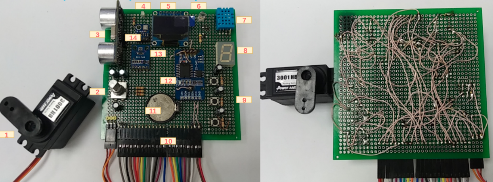
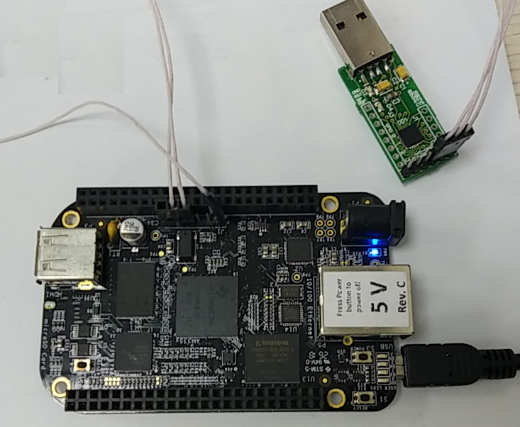

# Learn embedded Linux

I have started to learn embedded Linux and driver development with the [BeagleBone Black board](https://www.elinux.org/Beagleboard:BeagleBoneBlack). There I will write some usefull notes or commands about work with the BBB or about driver development.

# Table of contents
  - [Study plan](#Study-plan)
  - [Few words about homemade development board](#Few-words-about-homemade-development-board)
  - [Few words about schematic](#Few-words-about-schematic)
  - [Toolchain](#Toolchain)
  - [Bootloader](#Bootloader)
    - [Stages of loading OS](#What-are-there-stages-of-loading-OS)
    - [Building uboot](#Building-uboot)
  - [The Linux kernel](#The-Linux-kernel)
    - [Configuration and buildings](#Configuration-and-buildings)
  - [Installing all images to the BBB](#Installing-all-images-to-the-BBB)
    - [Flash uboot to SD](#Flash-uboot-to-SD)
    - [Setup NFS](#Setup-NFS)
  - [Boot the system](#Boot-the-system)

## Study plan

**Preparation**
  - Build set of tools for Cortex-A8 ARM
  - Build and flash U-Boot in eMMC memory on board
  - Build the Linux Kernel
  - Build root file system

**Learning**
  - Learn how to boot the Linux kernel
  - Learn what is device tree table
  - Learn how to write kernel modules

**[Bootlin's](https://bootlin.com/doc/training/linux-kernel/) laboratory works about Linux kernel course**
  - Make "Hello world" kernel module
  - Make I2C-driver for external I2C-device
  - Make driver avaliable in user-space through `/dev/devname`
  - Realize `fops` struct for i2c-device
  - Realize interrupt handler from the device

**Write drivers for homemade soldered board**
  - [SPI OLED](https://components101.com/oled-display-ssd1306) display based on ssd1306 controller
  - [Rotary](https://howtomechatronics.com/tutorials/arduino/rotary-encoder-works-use-arduino/)
  - Temperature and humidity sensor [DHT11](https://www.mouser.com/datasheet/2/758/DHT11-Technical-Data-Sheet-Translated-Version-1143054.pdf)
  - RTC I2C based on [DS3231](https://www.maximintegrated.com/en/products/analog/real-time-clocks/DS3231.html) controller
  - Buttons/Leds
  - Ambient light I2C-sensor based on [BH1750](https://www.mouser.com/datasheet/2/348/bh1750fvi-e-186247.pdf) controller
  - Barometric pressure I2C-sensor based on [BMP180](https://cdn-shop.adafruit.com/datasheets/BST-BMP180-DS000-09.pdf) controller
  - Ultrasonic ranging module [HC-SR04](https://cdn.sparkfun.com/datasheets/Sensors/Proximity/HCSR04.pdf)

## Few words about homemade development board
|  |
|:--:|
| *My Frankenstein* |
1. Servomotor, that allows for precise control of angular position
2. Mechanical rotary encoder that converts the angular position to digital output signals
3. Ultrasonic ranging module
4. Power LED
5. SPI OLED display
6. User's GPIO LED
7. Temperature and humidity sensor
8. Seven-segment display
9. User's button
10. Interface to BBB
11. CR2032 batary for RTC
12. RTC
13. Ambient light sensor
14. Barometric pressure sensor

|  |
|:--:|
| *The BBB and UART-USB module* |

## Few words about schematic
I don't know why I have decided to make this ugly board, but I think it doesn't matter for driver development and learning the Linux kernel :)

---in progress---

## Toolchain
Toolchain is a collection of different tools set up to tightly work together.
First of all, in embedded systems case, toolchain is needed to build a bootloader, a kernel and a root file system.
After this actions we need to use the toolchain to build kernel modules, system drivers and user-space applications.

**Every toolchain contains of:**
 - Compiler. It is need to translate source code to assemler mnemonics.
 - Binutils. It is need to use `as` and `ld`. Assembler translates the mnemonics to binary codes. Linker makes one executable file.
 - C library and inludes of the Linux kernel(for development).

We need a cross-toolchain, because we need to compile code for machine different from the machine it runs on.
Build machine in my case is `x86-64 platform`.
Target machine (where code will be executed) in my case is `ARM Cortex-A8 32 bit platform`.

**Toolchain choice depends on target platform:**
 - Processor architecture (ARM / MIPS / x86_64 and so on)
 - Little endian or big endian
 - Is there hard-float arithmetic?
 - Should we use ABI with or without `hf`?

If a processor has hardware hard-float block, we need to pick toolchain which will generate code for hf-block.
It will be more faster, than chip without hf, because without it compiler will use soft-float for double and float operations.
The Beagle Bone Black has ARMv7 arch and hardware float block.

**There are some ways to get needed toolchain:**
 - Download already pre-built toolchain, for example, from [Linaro](https://releases.linaro.org/components/toolchain/binaries/7.3-2018.05/arm-linux-gnueabihf/).
 - To make the toolchain itself.

There are some methods for the last way. We can build all set of tools by hand with help [this guide](https://clfs.org/view/clfs-embedded/arm/).
It's very long and hard way. Or we can use some frameworks for creating Linux distributions for embedded devices.
It is can be [Buildroot](https://en.wikipedia.org/wiki/Buildroot), [Yocto Project](https://en.wikipedia.org/wiki/Yocto_Project) and other Linux build systems.
There is [comparing embedded Linux build systems](https://elinux.org/images/0/0a/Embedded_Linux_Build_Systems.pdf) document, which can help to pick needed system.

I have decided to download alredy pre-built toolchain:
```sh
wget -c https://releases.linaro.org/components/toolchain/binaries/7.3-2018.05/arm-linux-gnueabihf/gcc-linaro-7.3.1-2018.05-x86_64_arm-linux-gnueabihf.tar.xz
tar xf gcc-linaro-7.3.1-2018.05-x86_64_arm-linux-gnueabihf.tar.xz
*use path to this toolchain during building modules, drivers and user-space*
```
## Bootloader
The main role of a bootloader is base initialisation of processor peripherals and loading a kernel of operating system to RAM memory.

### What are there stages of loading OS?

OS is loaded with help several stages
```
Power-reset ---> ROM-code ---> Preloader or Secondary-Program-Loader ---> u-boot/barebox or Third-Program-Loader ---> kernel-start
```

**ROM code**

A lot of modern SoCs have on-chip ROM memory. Code into the ROM is flashed on factory and it will executed by the CPU from power-up.
Immediately аfter power-up CPU has no access to the peripheral devices, such as RAM, storage and so on, because the CPU doesn't know something about its board.
Only the next stages can know about board's chipset, because we itself have configured, built and flashed right code(uboot/device-tree) to flash/eMMC card.
That's why the one can use only on-chip RAM memory. It is a SRAM usually.

This bootloader initializes a minimal amount of CPU and board hardware, then accesses the first partition of the SD or MMC card, which must be in FAT format,
and loads a file called "MLO", and executes it. "MLO" is the second-stage bootloader.

If thare aren't MMC, ROM-code tries to load the preloader into SRAM with help this interfaces:
 - SPI flash card
 - Ethernet/USB/UART

In the end of this stage SPL-code is loaded into SRAM and starts to execute.
If SoC-system has enough RAM memory, ROM code can load and TPL(`uboot.bin`) too.

**SPL**

SPL-code must configure DRAM-chip, using SoC DRAM controller, to load the TPL to it. 
This bootloader apparently also just reads the first partition of the SD card, and loads a file called "u-boot.bin", and executes it.
"u-boot.bin" is the third-stage bootloader.

**TPL: uboot or barebox**

u-boot code loads OS kernel from MMC/SD to DRAM, flattened device tree and ramdisk.

### Building uboot
```sh
git clone https://github.com/u-boot/u-boot.git uboot
cd uboot
git checkout v2019.10
```

We need to build the SPL and TPL. Other words we need to get two binary files:
 - MLO as the SPL
 - u-boot.bin as the TPL

To compile this code, we should configure the uboot sources with help `make <config-file-for-your-board>`.
There are a lot of ready config files in the `./uboot/configs/`. We can take ready file for a board or write own file.
Config file must specify a device tree file for a board and define some constants.
See `Makefile` which builds uboot for the BeagleBoneBlack board or type `make uboot` in the root of the repository.

After building you can find this files in the`./out/uboot/` directory:
 - MLO is secodary program loader
 - u-boot is itself bootloader in ELF format for debugging
 - u-boot.map is table of symbols
 - u-boot.bin is itself bootloader with dtb ready for executing in a target

## The Linux kernel
First of all we need to configure the kernel for our board. There are a lot of ready config files.
We can find its into `arch/$ARCH/configs/` directory.

### Configuration and buildings

The kernel uses `Kconfig` system to configure whole system and then `Kbuild` system to build the one.
You can learn the `Kconfig` system in the `$(KERNEL_SRC_DIR)/Documentation/Kbuild`. Also in the Linux source tree there is utilities which can read `Kconfig` files and show it in graphics menu.
For example:
```sh
make ARCH=arm menuconfig
```
The utilities generate `.config` file in root of Linux sources.
Then we can build kernel for target. Build system will use the `.config` file to build the kernel.
There are a lot of configuration variables in Kconfig. If we don't want to make own config file from scratch, we can use ready default config.
For example for armv7:
```sh
make ARCH=arm multi_v7_defconfig
make ARCH=arm CROSS_COMPILE=... all
```
After building into `./out/kernel/` directory this files will appeared:
 - Image is image of the kernel
 - zImage is image of the kernel in compressed state
 - am335x-boneblack.dtb - is Device Tree Blob for the BBB board
 - vmlinux is ELF file for debugger

## Installing all images to the BBB
The BBB has a JTAG-connector on the board, that's why we can flash the uboot to RAM, run it and, with help uboot command line,
copy its code to flash card. But I have no JTAG for armv7. I will use a SD-card and my work station to prepare the uboot for the BBB.

The AM335x chip has internal ROM memory, in which ROM-code was saved. This code can access to SD card during boot process.
We just need to make the first part of a SD card as booting part and format it to FAT.
Use [this](https://ragnyll.gitlab.io/2018/05/22/format-a-sd-card-to-fat-32linux.html) or [this](https://processors.wiki.ti.com/index.php/SD/MMC_format_for_OMAP3_boot) guides to format SD-card

### Flash uboot to SD

We can use the `fdisk` console utility for format SD card:

```sh
1. Insert SD card to PC and check with help `dmesg` name of the device. For example /dev/sdb
2. sudo umount /dev/sdb
3. sudo fdisk /dev/sdb
4. p - print the partition table
5. d - delete a partition
6. o - create a new empty DOS partition table
7. Create first boot partition:
Command (m for help): n
Partition type
   p   primary (0 primary, 0 extended, 4 free)
   e   extended (container for logical partitions)
Select (default p): p
Partition number (1-4, default 1): 1
First sector (2048-30535679, default 2048): 
Last sector, +sectors or +size{K,M,G,T,P} (2048-30535679, default 30535679): 204800

Created a new partition 1 of type 'Linux' and of size 99 MiB.

8. a - toggle a bootable flag
9. t - change a partition type:
Command (m for help): t
Selected partition 1
Hex code (type L to list all codes): L

 0  Empty           24  NEC DOS         81  Minix / old Lin bf  Solaris        
 1  FAT12           27  Hidden NTFS Win 82  Linux swap / So c1  DRDOS/sec (FAT-
 2  XENIX root      39  Plan 9          83  Linux           c4  DRDOS/sec (FAT-
 3  XENIX usr       3c  PartitionMagic  84  OS/2 hidden or  c6  DRDOS/sec (FAT-
 4  FAT16 <32M      40  Venix 80286     85  Linux extended  c7  Syrinx         
 5  Extended        41  PPC PReP Boot   86  NTFS volume set da  Non-FS data    
 6  FAT16           42  SFS             87  NTFS volume set db  CP/M / CTOS / .
 7  HPFS/NTFS/exFAT 4d  QNX4.x          88  Linux plaintext de  Dell Utility   
 8  AIX             4e  QNX4.x 2nd part 8e  Linux LVM       df  BootIt         
 9  AIX bootable    4f  QNX4.x 3rd part 93  Amoeba          e1  DOS access     
 a  OS/2 Boot Manag 50  OnTrack DM      94  Amoeba BBT      e3  DOS R/O        
 b  W95 FAT32       51  OnTrack DM6 Aux 9f  BSD/OS          e4  SpeedStor      
 c  W95 FAT32 (LBA) 52  CP/M            a0  IBM Thinkpad hi ea  Rufus alignment
 e  W95 FAT16 (LBA) 53  OnTrack DM6 Aux a5  FreeBSD         eb  BeOS fs        
 f  W95 Ext d (LBA) 54  OnTrackDM6      a6  OpenBSD         ee  GPT            
10  OPUS            55  EZ-Drive        a7  NeXTSTEP        ef  EFI (FAT-12/16/
11  Hidden FAT12    56  Golden Bow      a8  Darwin UFS      f0  Linux/PA-RISC b
12  Compaq diagnost 5c  Priam Edisk     a9  NetBSD          f1  SpeedStor      
14  Hidden FAT16 <3 61  SpeedStor       ab  Darwin boot     f4  SpeedStor      
16  Hidden FAT16    63  GNU HURD or Sys af  HFS / HFS+      f2  DOS secondary  
17  Hidden HPFS/NTF 64  Novell Netware  b7  BSDI fs         fb  VMware VMFS    
18  AST SmartSleep  65  Novell Netware  b8  BSDI swap       fc  VMware VMKCORE 
1b  Hidden W95 FAT3 70  DiskSecure Mult bb  Boot Wizard hid fd  Linux RAID auto
1c  Hidden W95 FAT3 75  PC/IX           bc  Acronis FAT32 L fe  LANstep        
1e  Hidden W95 FAT1 80  Old Minix       be  Solaris boot    ff  BBT            
Hex code (type L to list all codes): c (or e)
Changed type of partition 'Linux' to W95 FAT32 (LBA).

10. Create second partition for future user-space file system (partition type - Linux)
11. w - write table to disk and exit
```

Then we need to make file systems in partitions and copy MLO and uboot.bin to boot partitoin (`/dev/sdb1` in my case):
```sh
# boot partition
sudo umount /dev/sdb1
sudo mkfs.vfat -F 32 /dev/sdb1
sudo mkdir /mnt/tmp
sudo mount /dev/sdb1 /mnt/tmp
sudo cp ./out/uboot/MLO ./out/uboot/u-boot.bin /mnt/tmp
sudo umount /dev/sdb1

# ext4 data partition
sudo umount /dev/sdb2
sudo mkfs.ext4 /dev/sdb2
```

After this manipulations we need to disable the board, insert SD card, press `uSD button` on the board
(that will be booting from SD, not MMC) and turn on power.
After this we should see uboot booting log in uart console.

### Setup NFS

The next step is to configure u-boot and workstation to let the board download files,
such as the kernel image and Device Tree Binary (DTB), using the TFTP protocol through a
network connection. The BBB and u-boot(see compiling config) support Ethernet over USB.

**Setup TFTP**

 - For u-boot:
```
=> setenv ipaddr 192.168.0.100
=> setenv serverip 192.168.0.1
=> setenv ethact usb_ether
=> setenv usbnet_devaddr f8:dc:7a:00:00:02
=> setenv usbnet_hostaddr f8:dc:7a:00:00:01
=> saveenv
```
Then reset board(need that uboot read params again) and go to the u-boot again.

We won’t be able to see the network interface corresponding to the Ethernet over
USB device connection yet, because it’s only active when the board turns it on, from u-boot or
from Linux. When this happens, the network interface name will be enx<macaddr>. Given the
value we gave to usbnet_hostaddr, it will therefore be enxf8dc7a000001.

 - For workstation:
```sh
sudo apt install tftpd-hpa
sudo apt install tftp
```

 - Set network interface for eth-ver-usb:
```sh
nmcli con add type ethernet ifname enxf8dc7a000001 ip4 192.168.0.1/24
```

After this we can try to `ping 192.168.0.1` from u-boot. It can help to ensure that ethernet over usb works from uboot right and
that the interface on workstation has been uped right.

After installing we can put any files in the `/var/lib/tftpboot` on workstation and download this file
from u-boot with help:
```sh
tftp 0x81000000(any SDRAM address) <file-name-in-/var/lib/tftpboot-directory>
```

 - Add support ethernet over USB to LInux kernel config(needs for NSF over USB) and rebuild the kernel:
```
CONFIG_USB_GADGET=y
CONFIG_USB_MUSB_HDRC=y
CONFIG_USB_MUSB_GADGET=y
CONFIG_USB_MUSB_DSPS=y
CONFIG_AM335X_PHY_USB=y
CONFIG_USB_ETH=y
CONFIG_ROOT_NFS=y
```
I have used `make menuconfig`(it setups dependencies) and [this](https://elinux.org/BeagleBone_Usb_Networking) to enable eth-over-usb.
We need to use eth-over-usb during booting, that's why we must set this configs only as static [=y], not as modules [=m].

**Setup NFS server:**
```sh
1. sudo apt-get install nfs-kernel-server nfs-common portmap
2. Add
`<pwd-to-rootfs> 192.168.0.100(rw,no_root_squash,no_subtree_check)` line to /etc/exports file as root
3. sudo /usr/sbin/exportfs -arv
4. sudo /etc/init.d/nfs-kernel-server restart
```

## Boot the system
Before booting the kernel, we need to tell it which console to use and that
the root filesystem should be mounted over NFS, by setting some kernel parameters.

```sh
=> setenv bootargs root=/dev/nfs rw ip=192.168.0.100:::::usb0 console=ttyO0,115200n8 g_ether.dev_addr=f8:dc:7a:00:00:02 g_ether.host_addr=f8:dc:7a:00:00:01 nfsroot=192.168.0.1:<pwd-to-rootfs>,nfsvers=3 init=/linuxrc

=> saveenv
```

Automate the boot process:
```sh
=> setenv bootcmd 'tftp 0x81000000 zImage; tftp 0x82000000 am335x-boneblack.dtb; bootz 0x81000000 - 0x82000000'
=> saveenv
```
